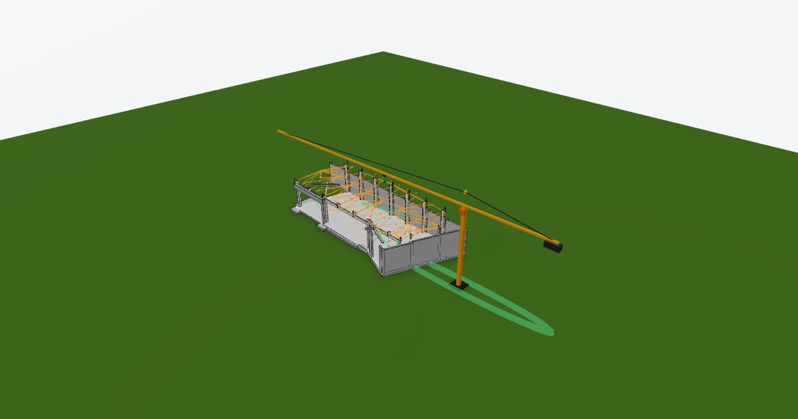

# Genba Lab

**Real building models, real what-ifs.**
A BIM simulation playground in the browser.

[**→ Open Genba Lab**](https://onuresen.github.io/Genba-Lab/)



*Genba (現場) is Japanese for "the actual site".*

---

## What it does

Load an IFC file. Each element becomes a part you can test.

- **Assembly sequence.** Watch the model go up, storey by storey.
- **Tower crane.** Sized and placed from the model. Lift checks per part. Lift path planner. Cab view.
- **Earthquake.** Shake the model by magnitude.
- **Fire.** Spread by fire rating. Fire compartments per storey.
- **Wind and rain.** Pressure arrows, streamlines, rain.
- **Thermal and acoustic.** Overlays from material and IFC data.
- **Metrics.** Cost, carbon per m², BOM (CSV), schedule, supply risk.
- **Material what-if.** Switch a wall or slab to steel or timber. See weight, carbon and cost change.
- **Factory layout.** Lay parts out by production bay.
- **Floor plan, section cut, explode view.**

Click a part to see its IFC data and all property sets.
Press `?` for keyboard shortcuts.

## Your data

- The file is read in your browser. Nothing is uploaded.
- The last model is kept in browser storage for next time.

## Read before trusting numbers

- Material, fire rating, load bearing and quantities come from IFC when present.
- Cost, carbon and seismic grade are estimates unless the IFC says otherwise.
- What-if materials use rough volume factors. They are for comparing, not design.
- Simulations are visual and indicative. They are not engineering checks.
- Each part says what came from IFC and what is estimated.

## Run locally

Needs Node 20.19+ or 22.

```bash
npm install
npm run dev      # http://localhost:5173
npm test         # IFC import, crane layout, render gate
npm run build    # output in dist/
```

## How it works

1. Pinned OpenBIM Core + `web-ifc` parse the file losslessly in a Web Worker; Genba then projects simulation parts.
2. Elements become parts (over 120 elements: grouped by storey + type).
3. Meshes go to IndexedDB. Part data goes to localStorage.
4. Every simulation reads the same part data.

More detail for contributors: `CLAUDE.md`.

## Built with

React · Three.js · React Three Fiber · GSAP · OpenBIM Core · web-ifc · Vite

## Origin

Genba Lab grew out of [Kit-of-Parts](https://github.com/onuresen/Kit-of-Parts), a modular building configurator.
Kit-of-Parts plays with ideal parts. Genba Lab tests real models.

## License

MIT. See `LICENSE`.
Bundled libraries keep their own licenses. See `THIRD_PARTY_NOTICES.md`.
